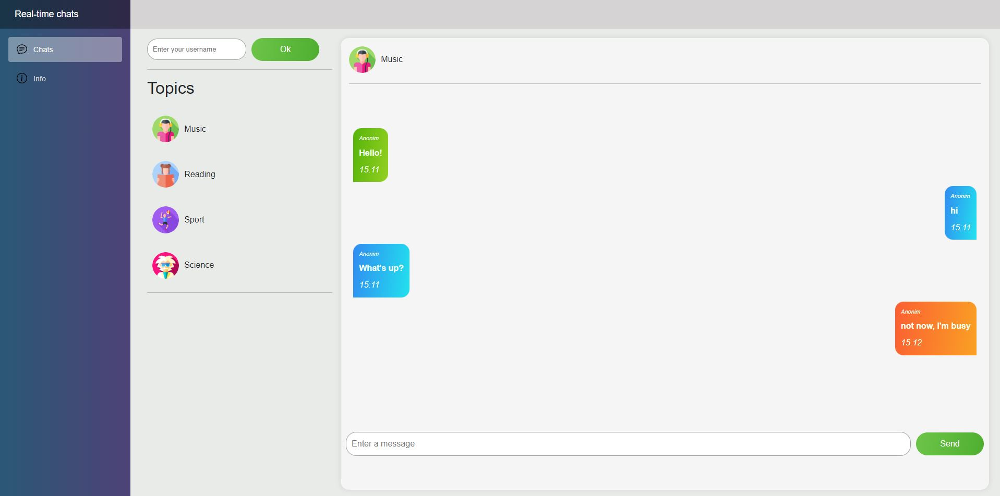

## Real-time chat application

### Overview

Website offers chat rooms with various topics for communication, where users can connect. Users can remain anonymous or provide their nickname.

- Green message - positive sentiment
- Blue message - neutral sentiment
- Orange message - negative sentiment

### Application structure

- source:
  - **RealTimeChatTask.DAL** - Data Access Layer. Implemented using *Generic Repository Pattern* and *Unit of Work*.
  - **RealTimeChatTask.BLL** - Business Logic Layer. Contains the services with business logic, implements validation.
  - **RealTimeChatTask.PL** - Presentation Layer. Contains endpoints for interaction with the client.
  - **RealTimeChatTask.Blazor** - Website. Сontains page components.
  - **RealTimeChatTask.SharedModels** - Shared models for Blazor and Presentation Layer.
- tests:
  - **RealTimeChatTask.Tests** - Unit tests.

### Technology stack

- ASP.NET Core - for backend-side
- EF Core - to interact with the database
- AutoMapper - to automatically map entities, dto's and models.
- FluentValidation - to implement validation
- Azure.AI.TextAnalytics - to integrate sentiment analysis
- Microsoft.Azure.SignalR - to interact with Azure SignalR Service. 
 $\\[0.3cm]$ 
 
- Blazor - for client-side
- Microsoft.AspNetCore.SignalR.Client - to interact with SignalR on the client side 
 $\\[0.3cm]$ 
 
- SQL Server - application database 
 $\\[0.3cm]$ 
 
- XUnit - to test application